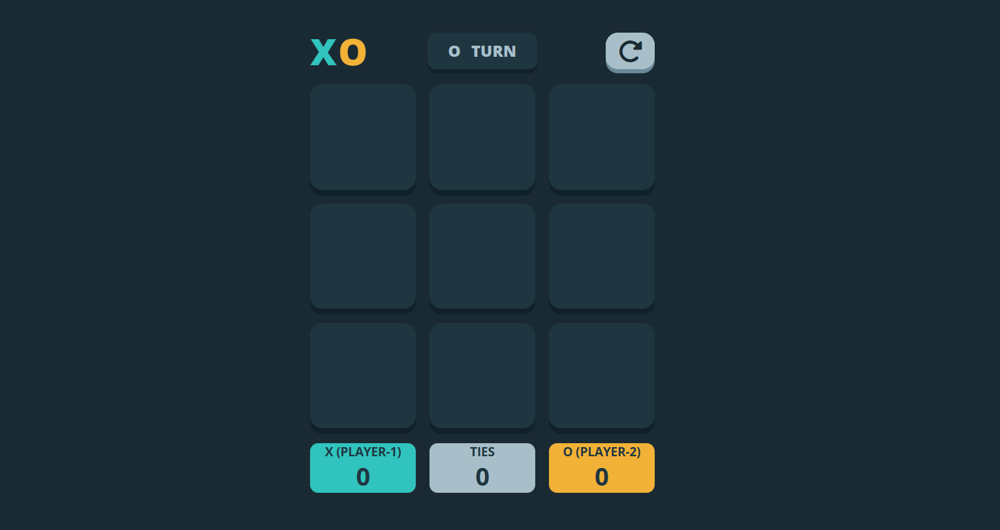

<P style="text-align : center; font-weight : 900; font-size : 40px">Tic Tac Toe Game</P>


<div align="center">
    
    
    
    
    
    
    
    <a href="https://motilalkhuas.github.io/TicTacToe/" target="_blank">
        
    </a>
</div>
<br>
<p>A responsive and interactive Tic Tac Toe game built with HTML, CSS, and JavaScript. This game features a multi-round system with score tracking, victory animations, and a clean UI.</p>

<p><i>Note: This project was built as part of my learning journey in web development.</i></p>




## ✨ Features

- 🎮 Two-player gameplay (X and O)
- 🔢 Customizable number of rounds
- 📊 Score tracking for wins and ties
- 🏆 Victory animations for winning combinations
- 🔄 Restart game functionality
- 📱 Fully responsive design
- ✨ Modern UI with smooth animations

## 🛠️ Technologies Used
<div style="display: flex; flex-wrap: wrap; gap: 5px;">
     <a href="https://html.com/"></a>
     <a href="https://www.w3.org/Style/CSS/"></a>
     <a href="https://developer.mozilla.org/en-US/docs/Web/JavaScript"></a>
</div>


## 🎮 How to Play

1. Enter the number of rounds you want to play
2. Player X (Player 1) always goes first
3. Take turns clicking on the grid to place your mark
4. The first player to get 3 marks in a row (horizontally, vertically, or diagonally) wins the round
5. The game continues until all rounds are completed
6. Final results are displayed showing total wins and ties

## 💻 Installation

1. Clone the repository:
   ```bash
   git clone https://github.com/MotilalKhuas/TicTacToe.git


2. Open `index.html` in your browser

## 🌐 Connect with Me
<table>
    <tr>
        <td align="center">
            <a href="https://github.com/MotilalKhuas">
                
                <br/>
                <sub>GitHub</sub>
            </a>
        </td>
        <td align="center">
            <a href="https://www.linkedin.com/in/khuas/">
                
                <br/>
                <sub>LinkedIn</sub>
            </a>
        </td>
        <td align="center">
            <a href="mailto:khuasmotilal57@gmail.com">
                
                <br/>
                <sub>Email</sub>
            </a>
        </td>
    </tr>
</table>

---
<br>

> 📘 **Learning Note**:  
> This Tic Tac Toe project was created for educational purposes while practicing HTML, CSS, and JavaScript skills.


## 📄 License

This project is licensed under the MIT License. See the [LICENSE](LICENSE) file for details.